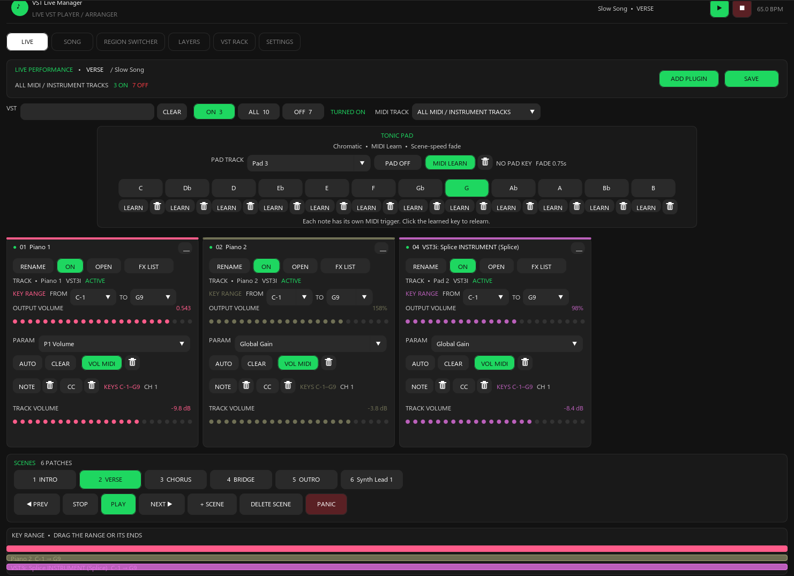
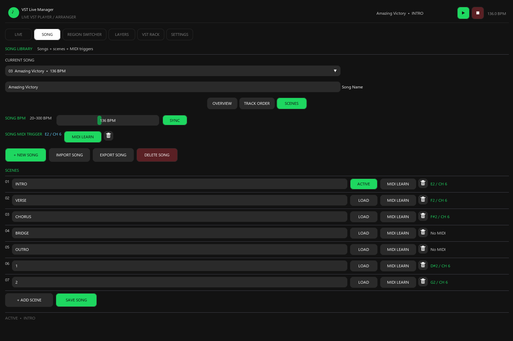
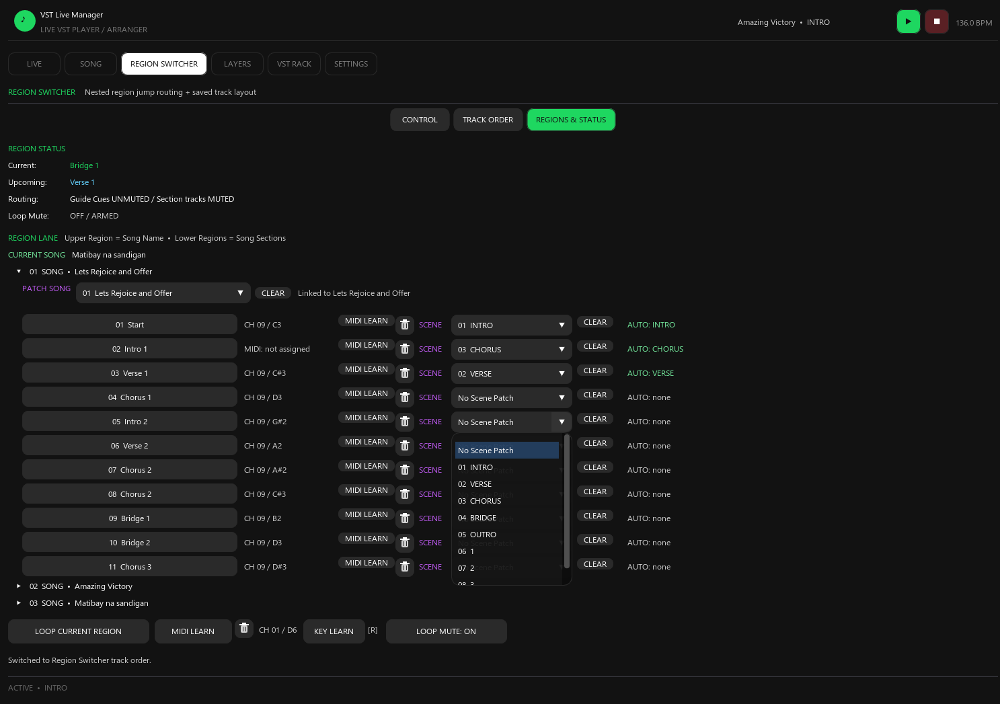
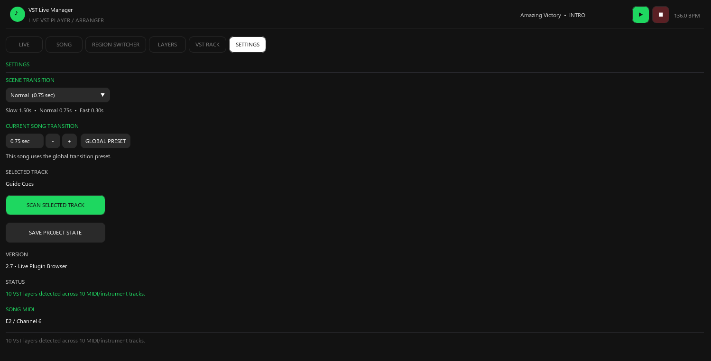
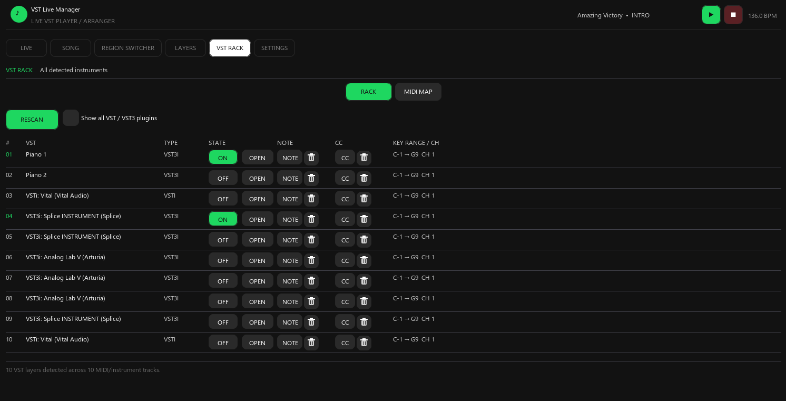

# 🎹 VST Live Manager

### Professional Live VST, Song & Region Control for REAPER

**VST Live Manager** transforms **REAPER** into a streamlined live-performance environment for keyboardists, musicians, and performers who need fast, reliable control over VST instruments, songs, layers, MIDI assignments, and performance regions.

Instead of navigating a traditional DAW during a live performance, VST Live Manager provides a dedicated workflow designed around **playing, switching, and controlling sounds in real time.**

---

## ✨ Why VST Live Manager?

REAPER is incredibly powerful, but a live performer often needs something simpler:

> **See the song. Choose the sound. Switch the layer. Play.**

VST Live Manager organizes your live-performance setup into dedicated workspaces so you can focus on performing rather than managing a complicated DAW interface.

---

## 🎛️ Six Dedicated Workspaces

### 🎤 Live

Your central performance workspace.

Designed for quickly controlling your live VST setup, switching sounds, and keeping the most important performance controls immediately accessible.

**Built around live performance rather than studio editing.**

---

### 🎵 Song

Organize your performance around your song list.

Create a structured setlist and prepare the sounds, configurations, and performance states you need for each song.

Perfect for:

* Live bands
* Keyboard players
* Worship teams
* Solo performers
* Cover musicians
* Rehearsal setups

---

### 🔀 Region Switcher

Control different sections of a song using REAPER regions.

Move between performance sections such as:

```text
INTRO
   ↓
VERSE
   ↓
CHORUS
   ↓
BRIDGE
   ↓
SOLO
   ↓
OUTRO
```

This allows your live setup to follow the structure of the music rather than forcing you to manually manage tracks and plugins while performing.

---

### 🎚️ Layers

Build complex keyboard and instrument setups by combining VST layers.

Create setups such as:

```text
                ┌── Piano
MIDI Keyboard ──┼── Strings
                ├── Pad
                └── Synth
```

Use MIDI control and key-range filtering to determine which instruments respond to different parts of the keyboard.

This makes it possible to create sophisticated live keyboard configurations while keeping control centralized.

---

### 🎹 VST Rack

Manage the VST instruments used in your performance rig.

The VST Rack provides a dedicated area for working with your live instrument setup instead of searching through a large DAW project during a performance.

Designed to make your VST environment:

* Easier to understand
* Faster to access
* More organized
* More performance-oriented

---

### ⚙️ Settings

Configure your VST Live Manager environment and tailor the system to your performance workflow.

The goal is to keep configuration separate from the actual performance interface so that your live workspace stays clean and focused.

---

# 🎹 Built for Keyboard Performance

VST Live Manager is designed around the needs of musicians who use a computer as part of their live instrument rig.

Typical setup:

```text
                 ┌──────────────────────┐
                 │      MIDI Keyboard   │
                 └──────────┬───────────┘
                            │
                            ▼
                 ┌──────────────────────┐
                 │  VST Live Manager    │
                 └──────────┬───────────┘
                            │
                            ▼
                 ┌──────────────────────┐
                 │        REAPER        │
                 └──────────┬───────────┘
                            │
              ┌─────────────┼─────────────┐
              ▼             ▼             ▼
           Piano         Strings        Synth
              │             │             │
              └─────────────┼─────────────┘
                            ▼
                       Audio Output
```

---

# 🎛️ MIDI Control

VST Live Manager is designed to work with MIDI-driven live setups.

Use MIDI control to build performance-oriented workflows including:

* MIDI note assignments
* MIDI CC control
* MIDI learn
* Key-range filtering
* Layer control
* VST switching
* Performance-region control

Your keyboard becomes more than an input device — it becomes the controller for your entire live instrument environment.

---

# 🎹 Key-Range Filtering

Create different instrument zones across your keyboard.

For example:

```text
LOWER OCTAVES
┌───────────────────────────────┐
│             PIANO             │
└───────────────────────────────┘

            SPLIT

┌───────────────────────────────┐
│         STRINGS + PAD         │
└───────────────────────────────┘
             UPPER
```

This allows multiple instruments to coexist while responding only to the keys assigned to them.

---

# 🔀 Song & Region Workflow

VST Live Manager connects your performance structure with REAPER's song and region workflow.

A typical performance can be organized as:

```text
SONG
 │
 ├── INTRO
 │    └── Piano
 │
 ├── VERSE
 │    └── Piano + Pad
 │
 ├── CHORUS
 │    └── Piano + Strings
 │
 ├── BRIDGE
 │    └── Synth
 │
 └── OUTRO
      └── Piano
```

This gives performers a structured way to move through a song while keeping the underlying REAPER project organized.

---

# 🖥️ Designed for a Live Performance Rig

VST Live Manager is intended to work alongside a dedicated computer-based music setup.

A typical rig can combine:

* 🎹 MIDI keyboard
* 💻 Windows PC
* 🎚️ REAPER
* 🎛️ VST instruments
* 🎧 Audio interface
* 🖥️ Performance display

The result is a compact software environment built specifically around live VST performance.

---

# 📸 Interface

### Live Workspace



### Song Workspace



### Region Switcher



### Settings



### VST Rack



---

# 🚀 Performance Philosophy

VST Live Manager follows a simple idea:

### Less DAW management. More playing.

A traditional DAW gives you enormous control, but live performance often requires a different interface.

Instead of constantly searching through:

```text
Tracks
→ FX
→ Plugins
→ MIDI settings
→ Regions
→ Automation
→ Project windows
```

VST Live Manager brings the most important performance concepts together:

```text
Songs
   ↓
Regions
   ↓
Layers
   ↓
VST Instruments
   ↓
MIDI Control
   ↓
Performance
```

---

# 🧩 Built Around REAPER

VST Live Manager does not try to replace REAPER.

Instead, it provides a dedicated control layer around REAPER's powerful audio and MIDI engine.

### VST Live Manager

**Performance Control**

↓

### REAPER

**Audio / MIDI Engine**

↓

### VST Instruments

**Your Sounds**

This combination allows musicians to keep the flexibility of REAPER while using a workflow designed specifically for live performance.

---

# 🎯 Ideal For

VST Live Manager can be useful for:

| Performer               | Use Case                            |
| ----------------------- | ----------------------------------- |
| 🎹 Keyboardists         | Multi-VST live rigs                 |
| 🎤 Live Bands           | Song-based sound switching          |
| ⛪ Worship Teams         | Song and section-based setups       |
| 🎸 Cover Bands          | Fast preset and region changes      |
| 🎼 Session Musicians    | Flexible MIDI/VST configurations    |
| 🧑‍💻 Home Performers   | Organized REAPER performance setups |
| 🎧 Electronic Musicians | Layered software instruments        |

---

# 💡 Core Concept

VST Live Manager turns a REAPER project from something you **operate** into something you can **perform with**.

```text
                 YOUR PERFORMANCE
                        │
                        ▼
              ┌───────────────────┐
              │ VST LIVE MANAGER  │
              └─────────┬─────────┘
                        │
          ┌─────────────┼─────────────┐
          ▼             ▼             ▼
       SONGS         LAYERS        REGIONS
          │             │             │
          └─────────────┼─────────────┘
                        ▼
                   MIDI CONTROL
                        │
                        ▼
                     REAPER
                        │
                        ▼
                  VST INSTRUMENTS
                        │
                        ▼
                  🎶 LIVE MUSIC
```

---

# 📦 Version

**VST Live Manager v2.7**

A perpetual-license version is represented on the website at **$29**.

---

# 🛠️ Technology

The website is built as a modern web application with:

* HTML
* CSS
* JavaScript
* React-based interface
* REAPER integration concepts
* MIDI-oriented performance control
* Client-side application routing

The website can be deployed as a static site, including **GitHub Pages**, when the project paths and SPA routing are configured correctly.

---

# 🌐 GitHub Pages

The website is structured to support deployment as a GitHub Pages project site.

Recommended structure:

```text
vst-live-manager/
│
├── index.html
├── 404.html
│
├── images/
│   ├── live.png
│   ├── song.png
│   ├── region-switcher.png
│   ├── settings.png
│   └── vst-rack.png
│
├── scripts/
│   └── index-CuwbyMVp.js
│
└── styles/
    └── index-BuDuVOfx.css
```

---

# 🎹 VST Live Manager

### Your REAPER project is powerful.

### Your live rig should be simple.

**Play more. Manage less.**

---

## ⭐ Project Status

VST Live Manager is an evolving live-performance environment focused on making REAPER more practical for musicians who use VST instruments on stage.

More live-performance features can be added without changing the fundamental workflow:

**Song → Region → Layer → VST → MIDI → Performance**

---

<p align="center">

**🎹 VST Live Manager**

*Live VST • Song • Region • Layer • MIDI Control for REAPER*

</p>
